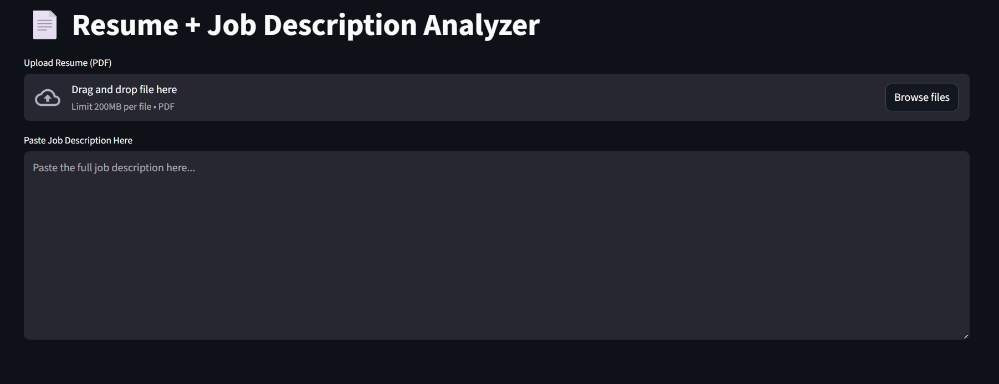
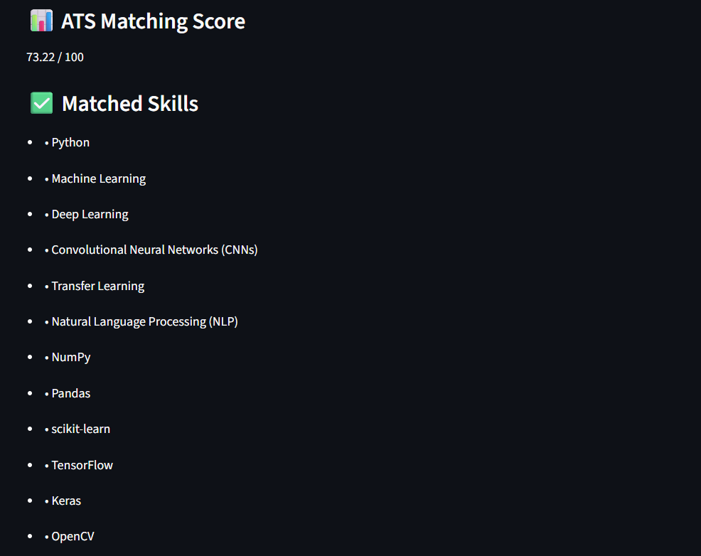
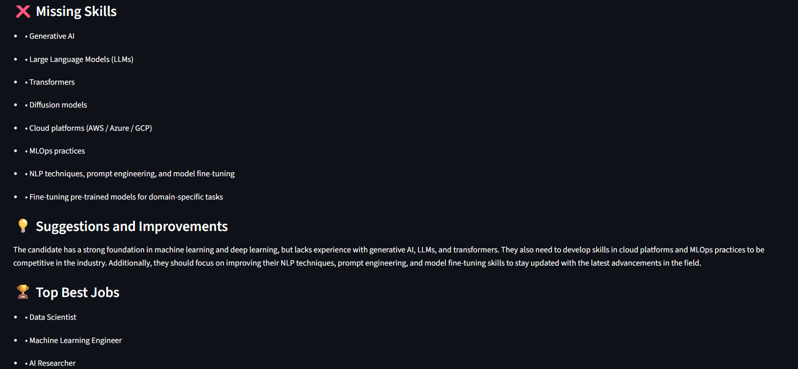

# Resume–Job Description Analyzer using RAG & GenAI

A **Resume and Job Description (JD) Analyzer** built using **Retrieval-Augmented Generation (RAG)** and **Generative AI**.  
This application evaluates how well a resume matches a job description by computing an **ATS score**, identifying **matched and missing skills**, suggesting **resume improvements**, and recommending the **best job role**.

---

## 🚀 Features

- 📊 **ATS Matching Score (0–100)**
- ✅ **Matched Skills**
- ❌ **Missing Skills**
- 💡 **Resume Suggestions & Improvements**
- 🏆 **Best Job Role Recommendation**
- 📄 **PDF Resume Upload**
- 🧠 **RAG-based contextual reasoning**
- 🌐 **Streamlit UI**

---

## 🧠 Architecture


This system follows a **Retrieval-Augmented Generation (RAG)** pipeline:

- The **resume (PDF)** and **job description (text)** are converted into embeddings.
- **Cosine similarity** between embeddings is used to calculate the **ATS score (0–100)**.
- A **FAISS vector database** stores job descriptions and retrieves relevant context.
- **LLaMA-3** uses the resume, JD, and retrieved context to generate:
  - Matched skills
  - Missing skills
  - Resume improvement suggestions
  - Best-matching job role


---
## 📸 Application Screenshots

### 🔹 Resume & Job Description Input


### 🔹 ATS Score & Skill Matching


### 🔹 Resume Suggestions & Best Job Role


---

## 📂 Project Structure

```text
Resume-JD_analyzer-RAG-GenAI/
│
├── app.py
│   └── Streamlit application for Resume & JD analysis
│
├── ingest_jobs.py
│   └── Script to ingest job descriptions and build FAISS vector store
│
├── requirements.txt
│   └── Python dependencies required to run the project
│
├── data/
│   └── jobs.csv
│       └── Real-world job descriptions dataset
│
├── screenshots/
│   ├── SS1.png
│   │   └── Resume & Job Description input screen
│   ├── SS2.png
│   │   └── ATS score and skill matching output
│   ├── SS3.png
│   │   └── Resume suggestions and best job role
│   └── architecture.png
│       └── RAG system architecture diagram
│
├── .gitignore
│   └── Files and folders ignored by Git
│
└── README.md
    └── Project documentation


## 🛠️ Tech Stack

- LLaMA-3 (Ollama)
- LangChain
- FAISS
- HuggingFace Embeddings
- Streamlit
- PDFPlumber
- NumPy

---

## ⚙️ Setup

```bash
pip install -r requirements.txt
python ingest_jobs.py
streamlit run app.py

```
---
## 🔮 Future Enhancements

- Structured JSON output parsing

- Skill-wise ATS breakdown

- Multiple resume comparison

- Cloud deployment (AWS / Azure)

- Authentication & user profiles

---

## 👤 Author

Vyshnav S
